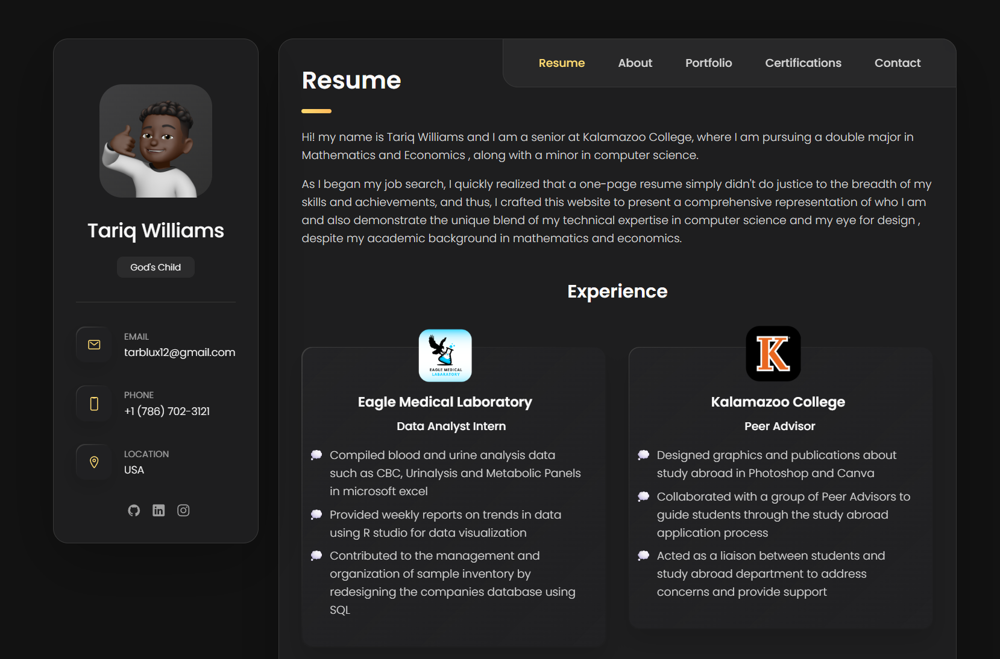
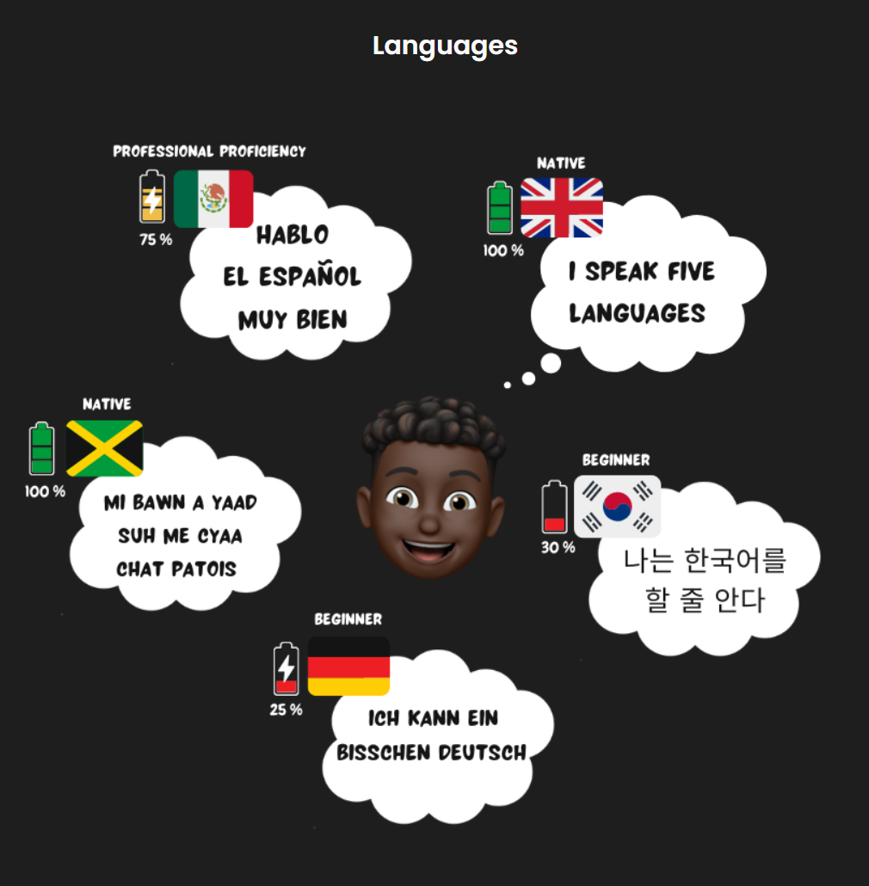
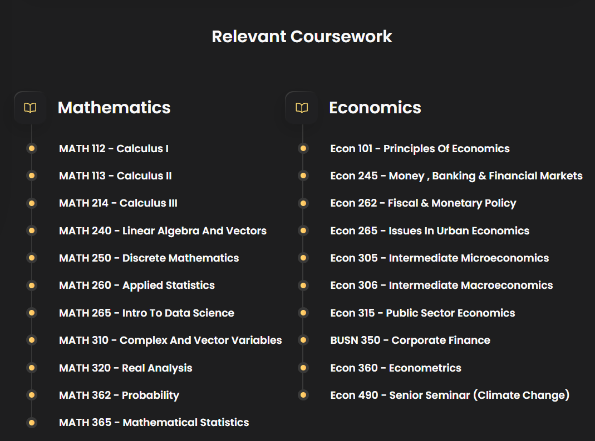
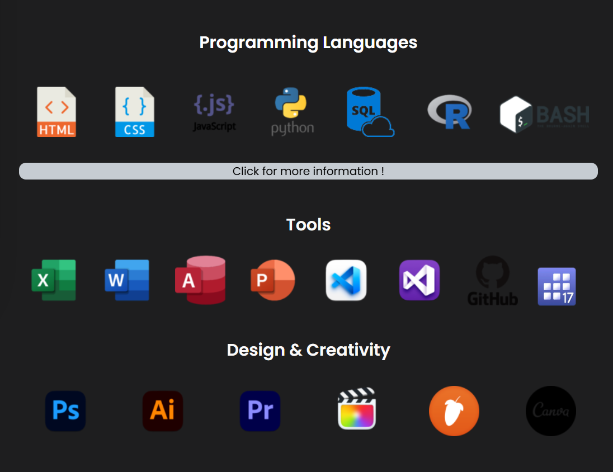

# Personal Website (Original Version)

> **Deprecated:** This version is no longer maintained. My latest personal website can be found at [tariqwill.com](https://tariqwill.com)

---
## Project Images

Below are some images from the original project:

## Motivation & Goals

During my senior year, while searching for a job, I struggled to get callbacks from my applications. I tried fitting everything onto the classic one-page résumé, but it quickly became clear that it wasn't enough to capture the full scope of my experience and interests.

That's when I decided to build a **personal website**, a space where I could present everything in greater detail and give a more complete picture of who I am.

---

## Tech Stack

### **1. HTML**
- **Description:** HyperText Markup Language  
- **How I Used It:** Structured the website's content and created the user-facing form fields.

### **2. CSS**
- **Description:** Cascading Style Sheets  
- **How I Used It:** Styled all content and implemented a responsive design to ensure the layout and navigation adapted seamlessly to different screen sizes.

### **3. JavaScript**
- **Description:** Programming Language  
- **How I Used It:** Handled the logic for the contact form submission and managed other interactive page elements.

---

## Reflection

---

### Biggest Challenge
As my first-ever programming project, the main challenge was understanding the boundaries of what was practical. I had ambitious ideas (like animating my Bitmoji to wave at visitors) but quickly realized my ambitions and my skills were not quite at the same level. This project was full of moments where I had to tame my vision to match my technical ability.

### Biggest Lesson
Completing this project gave me the confidence that I can truly build things with code. Most importantly, it provided a foundational understanding of what it means to take a programming project from an initial idea all the way to a finished product.
